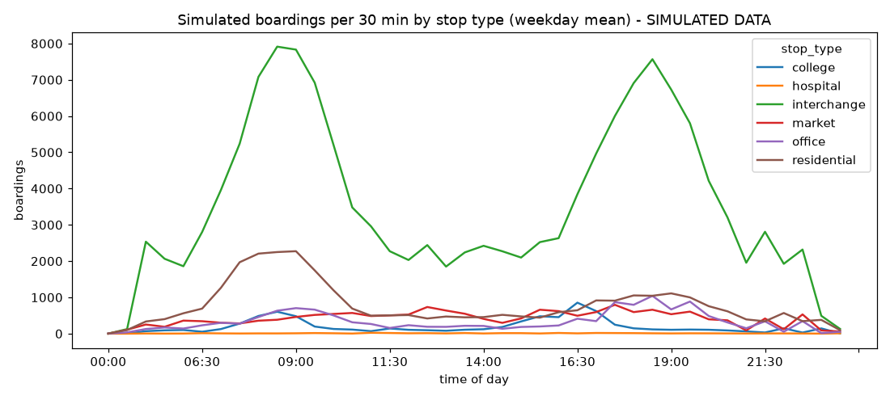
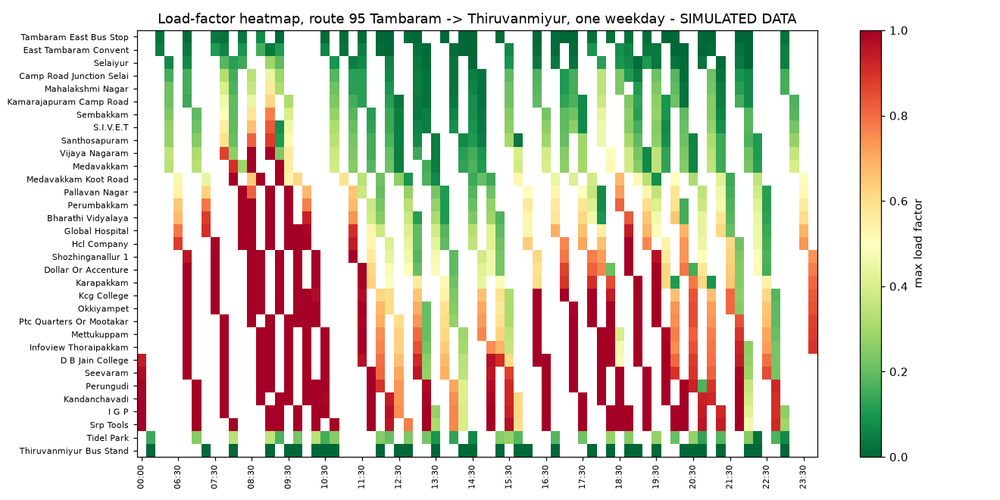
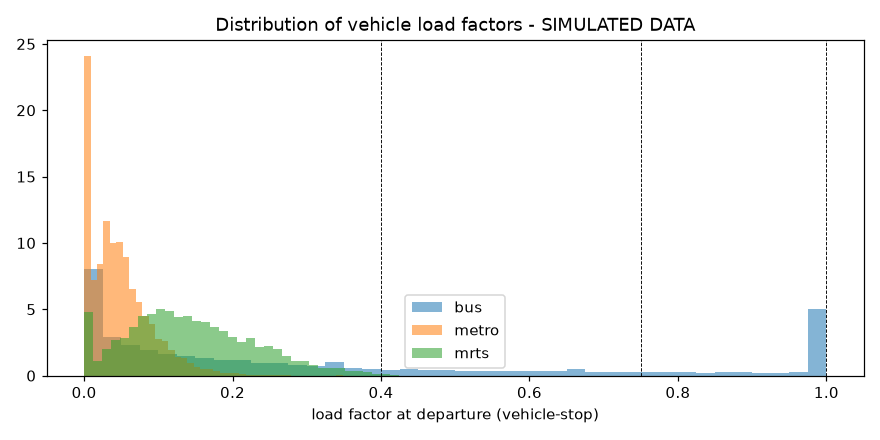

# Twin validation report

Generated 2026-10-03 06:38 by `python -m twin.validate`. **All figures are simulated data.**

Runs: 7 weekdays from 2026-09-21 (5 used) + 2 weekend days, calendar effects off; plus one day each of `cricket_match`, `rain_heavy`, `extra_trips` (6 extra trips per direction on route 95 in peaks), `cyclone` and `metro_disruption`, same seed as the baseline day.
Fitted parameters: `{"base_mode": {"bus": 0.25376820552707274, "mrts": 3.095548453393604, "metro": 2.8293233267167195}, "beta_per_km": 0.14999999999999997, "peak_width_scale": 1.4}`

## Checks

| Check | Result | Detail |
|---|---|---|
| Load conservation (load_after = load_before + boardings - alightings) | PASS | 0 violations in 151,911 rows |
| No negative loads | PASS | 0 rows |
| Capacity never exceeded | PASS | 0 rows |
| Vehicles empty at terminus | PASS | 0 trips |
| Daily total within 5% of target | PASS | 211,294 vs 207,600 (+1.8%) |
| Weekday/weekend ratio within 10% | PASS | 1.50 vs 1.47 |
| Event-day ratio between 1.1 and 1.3 | PASS | 1.197 |
| Peak-hour share in [0.45, 0.6] (assumption) | PASS | 0.530 |
| Scenario direction: heavy rain increases bus load | PASS | mean bus load x1.063 |
| Scenario direction: extra trips lower load on the target route | PASS | BUS_95 peak mean LF 0.419 -> 0.359; left-behind 2,862 -> 2,244 |
| Scenario direction: metro disruption raises metro load in the window | PASS | metro 08-10 mean LF 0.072 -> 0.107 |
| Scenario direction: cyclone halts MRTS; metro loses less than the 25% day-total cut | PASS | MRTS vehicle-stops 0; metro boardings x0.84 (day total x0.75) |

## Daily boardings by mode (weekday mean)

| Mode | Simulated | Target | Error |
|---|---|---|---|
| bus | 24,791 | 24,000 | +3.3% |
| metro | 84,921 | 83,600 | +1.6% |
| mrts | 101,582 | 100,000 | +1.6% |

Unmet demand (gave up after patience / refused twice / end of service): 9,965 per day (7 days incl. weekend); reasons {'patience': 32712, 'end_of_service': 25725, 'refused_twice': 11321}.
CROWDED vehicle-stops per weekday: 767. Crowd-level shares over all vehicle-stops: LOW 80%, MEDIUM 8%, CROWDED 7%, HIGH 4%.

## MRTS stations against published figures (reported, not fitted)

| Check | Simulated | Published |
|---|---|---|
| MRTS_VLCY footfall (boardings + alightings) per weekday | 16,915 | 70,000 |
| Share of MRTS boardings at MRTS_BEACH, MRTS_TMLI, MRTS_VLCY | 21% | 40% (2012) |

The twin only generates trips between modelled stops, so station footfall that includes riders from outside the corridor (suburban rail at St. Thomas Mount, buses not modelled) is expected to come out lower.

## Figures

## Sanity check against reality

No measured hourly ridership profile for these routes or stations was available to compare against (the CMRL figures used are daily/monthly totals). The peak-hour share band (45%-60%) is itself an assumption. **No claim of a match to real hourly patterns is made.** The bus total is an assumption (see ASSUMPTIONS.md); the MRTS total uses a 2023 line-wide figure from before the March 2026 extension; the metro total is anchored to published figures through an assumed corridor share.

> A simulation twin calibrated to published ridership totals and designed to ingest real AFC and sensor feeds. Bus-level counts are assumptions until MTC data is available.